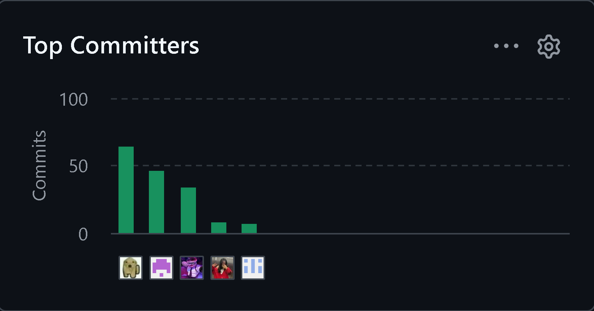

# Project Report Collaboration Insights

El siguiente enlace lleva al URL del repositorio que se encuentra disponible en nuestra organización pública:
https://github.com/SourceSoldiers/aquanetix-report.git

Para la entrega del avance 1, se procede a mostrar el análiss de colaboración, el cual representa el número de contribuciones realizadas en el repositorio del informe.

  

