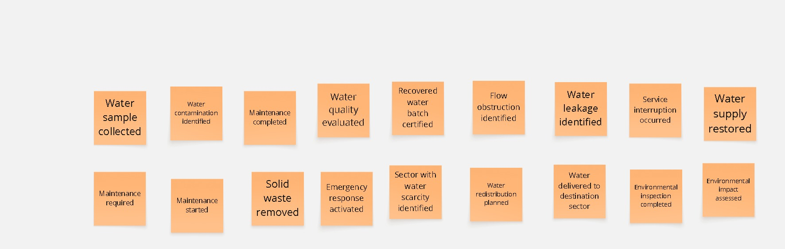
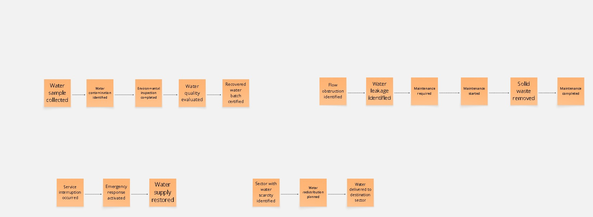
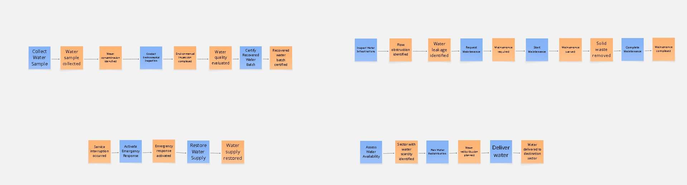
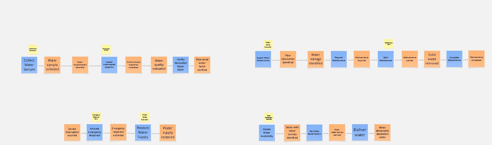
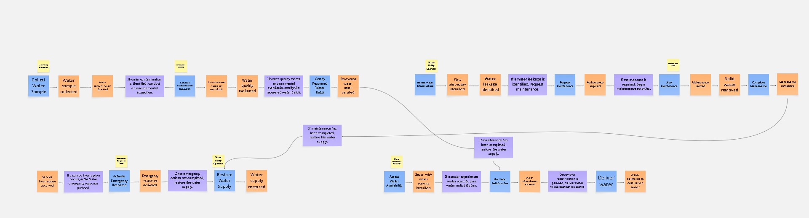

### 2.4. Big Picture Event Storming

En esta sección se presenta el Big Picture Event Storming desarrollado para comprender el funcionamiento del dominio de la gestión del agua sobre el cual se desarrolla Aquanetix. Mediante una sesión colaborativa, el equipo identificó los principales eventos del negocio, organizó los procesos cronológicamente e incorporó los Commands, Actors y Business Policies que intervienen en cada flujo. Todo el modelado fue realizado utilizando la plataforma Miro, permitiendo construir el mapa de manera colaborativa y facilitar la comprensión de los procesos del dominio. Con el fin de brindar una mejor visualización del proceso de modelado, el tablero desarrollado en Miro se encuentra disponible en el siguiente enlace: https://shorturl.at/zs9sJ

#### Paso 1: Identificación de Domain Events

   

En esta primera etapa se realizó una lluvia de ideas para identificar todos los Domain Events relacionados con el dominio de la gestión del agua. Posteriormente, los eventos fueron refinados para conservar únicamente aquellos que representan hechos relevantes del negocio, eliminando elementos propios de la implementación de la solución tecnológica. Todos los Domain Events fueron representados mediante notas adhesivas de color naranja y redactados en tiempo pasado.

#### Paso 2: Organización cronológica de los Domain Events

   

Una vez identificados los Domain Events, estos fueron organizados cronológicamente de acuerdo con el comportamiento natural de los procesos del negocio. Como resultado, se estructuraron cuatro flujos principales que representan la evaluación de la calidad del agua, el mantenimiento de la infraestructura hídrica, la continuidad del servicio y la distribución del recurso hídrico.

#### Paso 3: Incorporación de Commands

   

En esta etapa se incorporaron los Commands, representados mediante notas adhesivas de color azul. Cada Command representa una decisión importante del negocio que da origen a uno o más Domain Events, permitiendo modelar las principales acciones que impulsan el desarrollo de cada proceso sin entrar en detalles propios de la implementación del sistema.

#### Paso 4: Incorporación de Actors

   

Posteriormente, se identificaron los actores que intervienen en la ejecución de los principales Commands del negocio. Estos fueron representados mediante notas adhesivas de color amarillo y ubicados sobre los comandos correspondientes, permitiendo visualizar de manera clara qué participantes intervienen en cada uno de los procesos representados dentro del dominio.

#### Paso 5: Incorporación de Business Policies

   

Finalmente, se incorporaron las Business Policies, representadas mediante notas adhesivas de color morado. Estas políticas describen las reglas del negocio que establecen cuándo un Domain Event desencadena la ejecución de un nuevo Command. Asimismo, permitieron relacionar determinados flujos del negocio mediante reglas que conectan procesos distintos, representando de forma más precisa el comportamiento general del dominio de la gestión del agua.