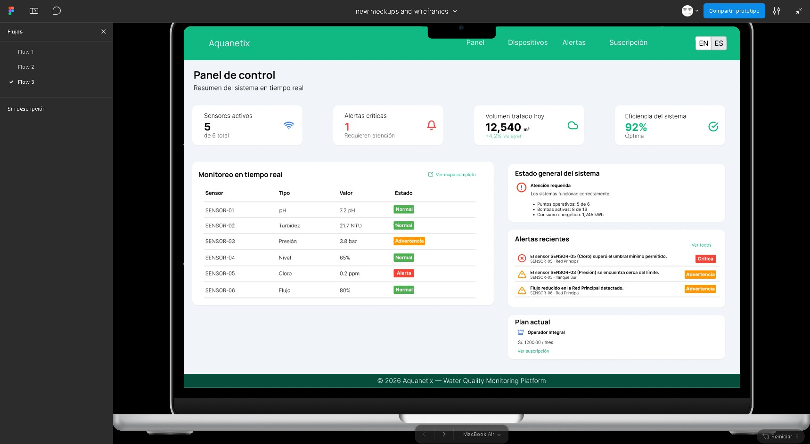

## 4.5. Web Applications Prototyping

Se desarrolló un prototipo interactivo que simula los flujos principales de la aplicación.
La siguiente figura muestra una vista previa del prototipo:

Enlace del video del prototipo:
[Ver video del prototipo](https://upcedupe-my.sharepoint.com/personal/u202414345_upc_edu_pe/_layouts/15/stream.aspx?id=%2Fpersonal%2Fu202414345%5Fupc%5Fedu%5Fpe%2FDocuments%2Fupc%2Dpre%2D202610%2D1asi0729%2D12010%2DSourceSoldiers%2Dprototypenavigation%2Dsprint%2D2%2Fupc%2Dpre%2D202610%2D1asi0729%2D12010%2DSourceSoldiers%2Dprototypenavigation%2Dsprint%2D2%2Emp4&ga=1&referrer=StreamWebApp%2EWeb&referrerScenario=AddressBarCopied%2Eview%2Eb21e3fb9%2Dd6fa%2D41e1%2Da3f6%2D2abda3022da4)

