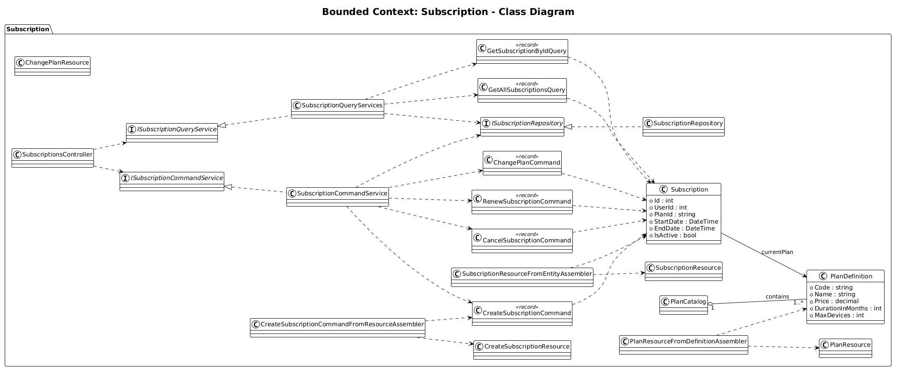
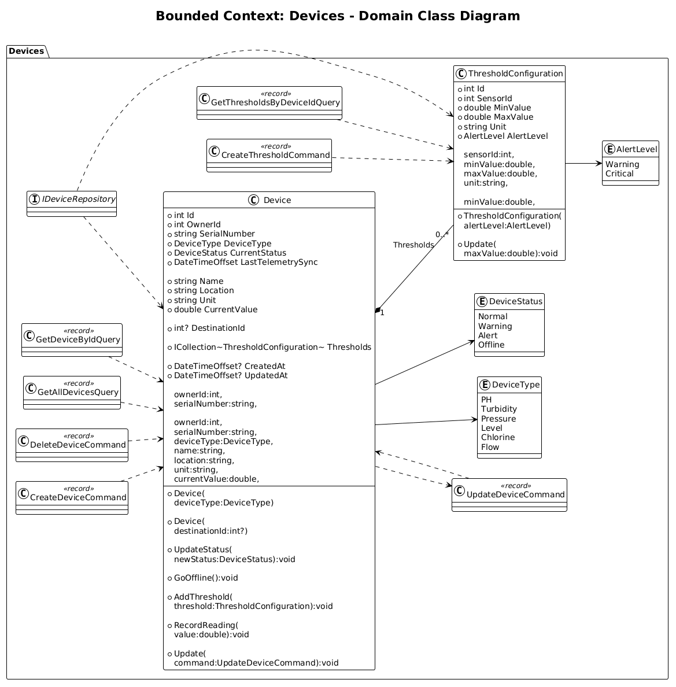
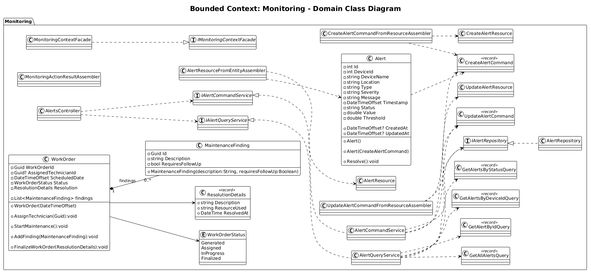
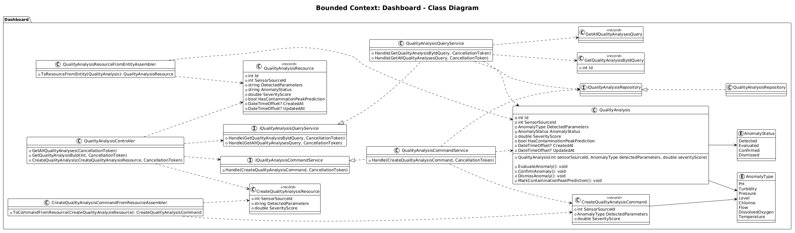
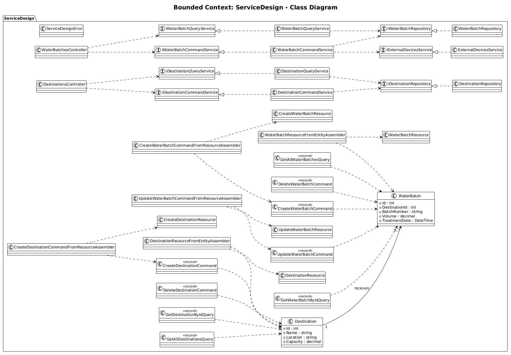

### 4.7. Software Object-Oriented Design

El desarrollo estructural de nuestra plataforma se fundamenta estrictamente en el paradigma orientado a objetos, diseñado en C# siguiendo los principios de Domain-Driven Design (DDD) y patrones como CQRS (Command Query Responsibility Segregation). Esta decisión metodológica nos brinda la capacidad de segmentar los procesos en *Bounded Contexts* independientes, garantizando una alta cohesión y un bajo acoplamiento. A través de la correcta aplicación del encapsulamiento, modelamos entidades de dominio robustas que protegen sus invariantes y reglas de negocio, facilitando la escalabilidad del sistema.

A continuación, se presentan los diagramas de clases UML y el diccionario de datos enfocado en las entidades de dominio centrales para cada *Bounded Context* identificado.

### 4.7.1. Class Diagrams

#### 1. Bounded Context: Subscription
Este contexto gestiona las suscripciones activas de los usuarios y el catálogo de planes disponibles en la plataforma.

  

**Diccionario de Clases de Dominio:**
* **Clase `Subscription` (Aggregate Root):** Representa la suscripción activa de un cliente en el sistema.
  * *Atributos:* `- Id : int`, `- UserId : int`, `- PlanId : string`, `- StartDate : DateTime`, `- EndDate : DateTime`, `- IsActive : bool`
* **Clase `PlanDefinition`:** Entidad que define las características y límites de un plan comercial.
  * *Atributos:* `- Code : string`, `- Name : string`, `- Price : decimal`, `- DurationInMonths : int`, `- MaxDevices : int`

#### 2. Bounded Context: Devices
Este contexto maneja el inventario, estado y configuración técnica de los sensores IoT físicos.

  

**Diccionario de Clases de Dominio:**
* **Clase `Device` (Aggregate Root):** Representa el hardware IoT instalado en la infraestructura hídrica.
  * *Atributos:* `- Id : int`, `- OwnerId : int`, `- SerialNumber : string`, `- DeviceType : DeviceType`, `- DeviceStatus : DeviceStatus`, `- LastTelemetrySync : DateTimeOffset`, `- Name : string`, `- Location : string`, `- Unit : string`, `- CurrentValue : double`, `- DestinationId : int?`
  * *Métodos:* `+ UpdateStatus(newStatus: DeviceStatus) : void`, `+ GoOffline() : void`, `+ AddThreshold(threshold: ThresholdConfiguration) : void`, `+ RecordReading(value: double) : void`
* **Clase `ThresholdConfiguration`:** Configuración de los límites operativos permitidos para un dispositivo específico.
  * *Atributos:* `- Id : int`, `- SensorId : int`, `- MinValue : double`, `- MaxValue : double`, `- Unit : string`, `- AlertLevel : AlertLevel`
  * *Métodos:* `+ Update(maxValue: double) : void`
* **Enumeraciones:** * `DeviceType`: PH, Turbidity, Pressure, Level, Chlorine, Flow.
  * `DeviceStatus`: Normal, Warning, Alert, Offline.
  * `AlertLevel`: Warning, Critical.

#### 3. Bounded Context: Monitoring
Este contexto encapsula el motor de alertas tempranas y la generación de órdenes de mantenimiento operativo.

  

**Diccionario de Clases de Dominio:**
* **Clase `Alert` (Aggregate Root):** Almacena las anomalías detectadas por los dispositivos.
  * *Atributos:* `- Id : int`, `- DeviceId : int`, `- DeviceName : string`, `- Location : string`, `- Type : string`, `- Severity : string`, `- Message : string`, `- Timestamp : DateTimeOffset`, `- Status : string`, `- Value : double`, `- Threshold : double`
  * *Métodos:* `+ Resolve() : void`
* **Clase `WorkOrder`:** Representa una orden de trabajo para mantenimiento en campo.
  * *Atributos:* `- WorkOrderId : Guid`, `- AssignedTechnicianId : Guid?`, `- ScheduledDate : DateTimeOffset`, `- Status : WorkOrderStatus`
  * *Métodos:* `+ AssignTechnician(Guid) : void`, `+ StartMaintenance() : void`, `+ AddFinding(MaintenanceFinding) : void`, `+ FinalizeWorkOrder(ResolutionDetails) : void`
* **Clase `MaintenanceFinding`:** Hallazgos registrados durante la ejecución de una orden de trabajo.
  * *Atributos:* `- Id : Guid`, `- Description : string`, `- RequiresFollowUp : bool`
* **Enumeración:** `WorkOrderStatus` (Generated, Assigned, InProgress, Finalized).

#### 4. Bounded Context: Dashboard
Este contexto se enfoca en el análisis detallado de la calidad del agua y la predicción de picos de contaminación.

  

**Diccionario de Clases de Dominio:**
* **Clase `QualityAnalysis` (Aggregate Root):** Consolida la evaluación analítica de posibles anomalías hídricas.
  * *Atributos:* `- Id : int`, `- SensorSourceId : int`, `- DetectedParameters : AnomalyType`, `- AnomalyStatus : AnomalyStatus`, `- SeverityScore : double`, `- HasContaminationPeakPrediction : bool`
  * *Métodos:* `+ EvaluateAnomaly() : void`, `+ ConfirmAnomaly() : void`, `+ DismissAnomaly() : void`, `+ MarkContaminationPeakPrediction() : void`
* **Enumeraciones:** * `AnomalyStatus`: Detected, Evaluated, Confirmed, Dismissed.
  * `AnomalyType`: PH, Turbidity, Pressure, Level, Chlorine, Flow, DissolvedOxygen, Temperature.

#### 5. Bounded Context: Service Design
Este contexto administra la logística del agua tratada, trazando lotes (batches) hacia destinos específicos.

  

**Diccionario de Clases de Dominio:**
* **Clase `WaterBatch` (Aggregate Root):** Registra volúmenes de agua procesados listos para distribución.
  * *Atributos:* `- Id : int`, `- DestinationId : int`, `- BatchNumber : string`, `- Volume : decimal`, `- TreatmentDate : DateTime`
* **Clase `Destination`:** Entidad que define hacia dónde se redirigen los lotes de agua tratada.
  * *Atributos:* `- Id : int`, `- Name : string`, `- Location : string`, `- Capacity : decimal`