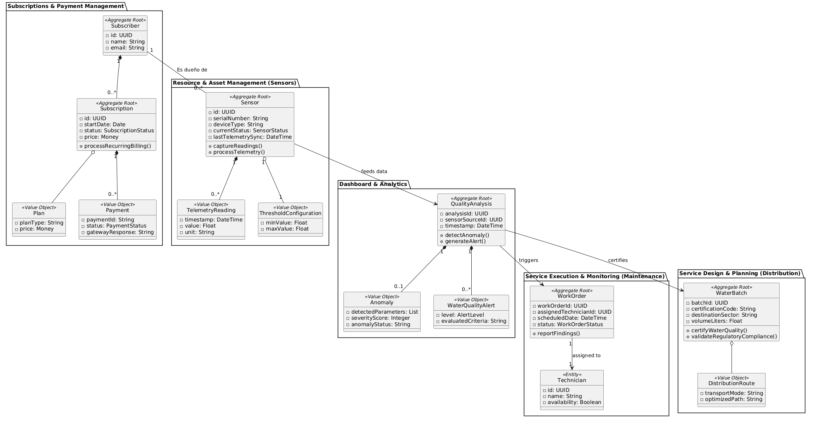

### 4.7. Software Object-Oriented Design

El desarrollo estructural de nuestra plataforma se fundamenta estrictamente en el paradigma orientado a objetos. Esta decisión metodológica nos brinda la capacidad de segmentar los distintos procesos del negocio hídrico garantizando una expansión futura sin fricciones. A través de la correcta aplicación del encapsulamiento para proteger la información corporativa, sumado a la herencia para jerarquizar nuestras entidades de monitoreo, diseñaremos componentes de software robustos, facilitando enormemente las labores de actualización técnica.

### 4.7.1. Class Diagrams

### 4.7.2. Class Dictionary

## Bounded Context: Subscriptions & Payment Management

### Clase: Subscriber «Aggregate Root»
**Descripción:** Representa al cliente titular de la cuenta y dueño de los recursos en el sistema.
* **Atributos:**
    * `id` : UUID - Identificador único del suscriptor.
    * `name` : String - Nombre o razón social.
    * `email` : String - Correo electrónico de contacto.

### Clase: Subscription «Aggregate Root»
**Descripción:** Entidad que gestiona el ciclo de vida del servicio contratado.
* **Atributos:**
    * `id` : UUID - Identificador de la suscripción.
    * `startDate` : Date - Fecha de inicio del servicio.
    * `status` : SubscriptionStatus - Estado (Activo, Cancelado, Pendiente).
    * `price` : Money - Valor del servicio.
* **Métodos:**
    * `processRecurringBilling()` : void - Gestiona los cobros automáticos.

### Clase: Plan «Value Object»
**Descripción:** Define el tipo de plan y su costo asociado.
* **Atributos:**
    * `planType` : String - Categoría del plan.
    * `price` : Money - Costo definido.

### Clase: Payment «Value Object»
**Descripción:** Información detallada de las transacciones de pago.
* **Atributos:**
    * `paymentId` : String - ID de transacción de la pasarela.
    * `status` : PaymentStatus - Resultado del pago.
    * `gatewayResponse` : String - Respuesta técnica del proveedor.

---

## Bounded Context: Resource & Asset Management (Sensors)

### Clase: Sensor «Aggregate Root»
**Descripción:** Dispositivo IoT encargado de la recolección de datos en campo.
* **Atributos:**
    * `id` : UUID - ID único del dispositivo.
    * `serialNumber` : String - Número de serie de fábrica.
    * `deviceType` : String - Tipo de sensor (Flujo, Calidad, etc.).
    * `currentStatus` : SensorStatus - Estado operativo actual.
    * `lastTelemetrySync` : DateTime - Última sincronización de datos.
* **Métodos:**
    * `captureReadings()` : void - Activa la captura de datos.
    * `processTelemetry()` : void - Procesa los datos crudos recibidos.

### Clase: TelemetryReading «Value Object»
**Descripción:** Representa una lectura individual de telemetría.
* **Atributos:**
    * `timestamp` : DateTime - Fecha y hora de la lectura.
    * `value` : Float - Valor numérico registrado.
    * `unit` : String - Unidad de medida.

---

## Bounded Context: Dashboard & Analytics

### Clase: QualityAnalysis «Aggregate Root»
**Descripción:** Proceso encargado de analizar los datos para asegurar los estándares de calidad.
* **Atributos:**
    * `analysisId` : UUID - Identificador del análisis.
    * `sensorSourceId` : UUID - Referencia al sensor de origen.
    * `timestamp` : DateTime - Fecha del análisis.
* **Métodos:**
    * `detectAnomaly()` : void - Identifica patrones fuera de lo normal.
    * `generateAlert()` : void - Dispara alertas si se detectan fallos.

### Clase: Anomaly «Value Object»
**Descripción:** Registro detallado de una anomalía detectada.
* **Atributos:**
    * `detectedParameters` : List - Lista de parámetros afectados.
    * `severityScore` : Integer - Nivel de severidad técnica.
    * `anomalyStatus` : String - Estado actual de la anomalía.

---

## Bounded Context: Service Execution & Monitoring (Maintenance)

### Clase: WorkOrder «Aggregate Root»
**Descripción:** Orden de trabajo generada para mantenimiento o inspección.
* **Atributos:**
    * `workOrderId` : UUID - ID único de la orden.
    * `assignedTechnicianId` : UUID - ID del técnico asignado.
    * `scheduledDate` : DateTime - Fecha programada para la ejecución.
    * `status` : WorkOrderStatus - Estado de la orden.
* **Métodos:**
    * `reportFindings()` : void - Registra los hallazgos técnicos.

### Clase: Technician «Entity»
**Descripción:** Personal técnico encargado de las operaciones de campo.
* **Atributos:**
    * `id` : UUID - ID del técnico.
    * `name` : String - Nombre completo.
    * `availability` : Boolean - Disponibilidad para nuevas órdenes.

---

## Bounded Context: Service Design & Planning (Distribution)

### Clase: WaterBatch «Aggregate Root»
**Descripción:** Lote de agua procesada que debe cumplir con normativas de distribución.
* **Atributos:**
    * `batchId` : UUID - ID del lote.
    * `certificationCode` : String - Código de certificación sanitaria.
    * `destinationSector` : String - Sector de destino de la red.
    * `volumeLiters` : Float - Volumen total en litros.
* **Métodos:**
    * `certifyWaterQuality()` : void - Emite la certificación de calidad.
    * `validateRegulatoryCompliance()` : void - Valida el cumplimiento de normas.
