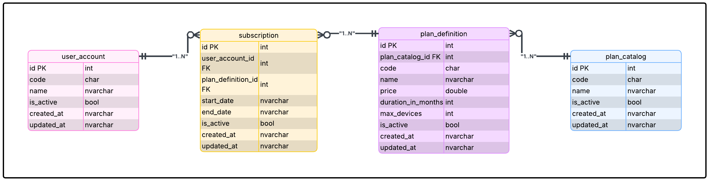
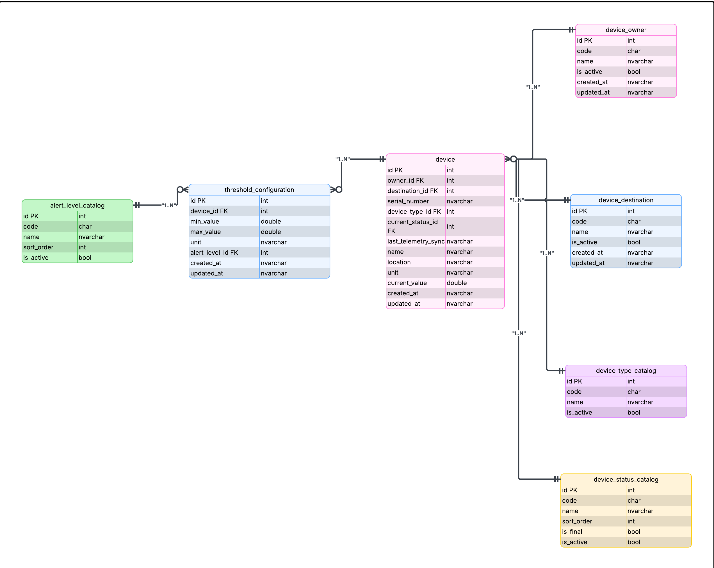
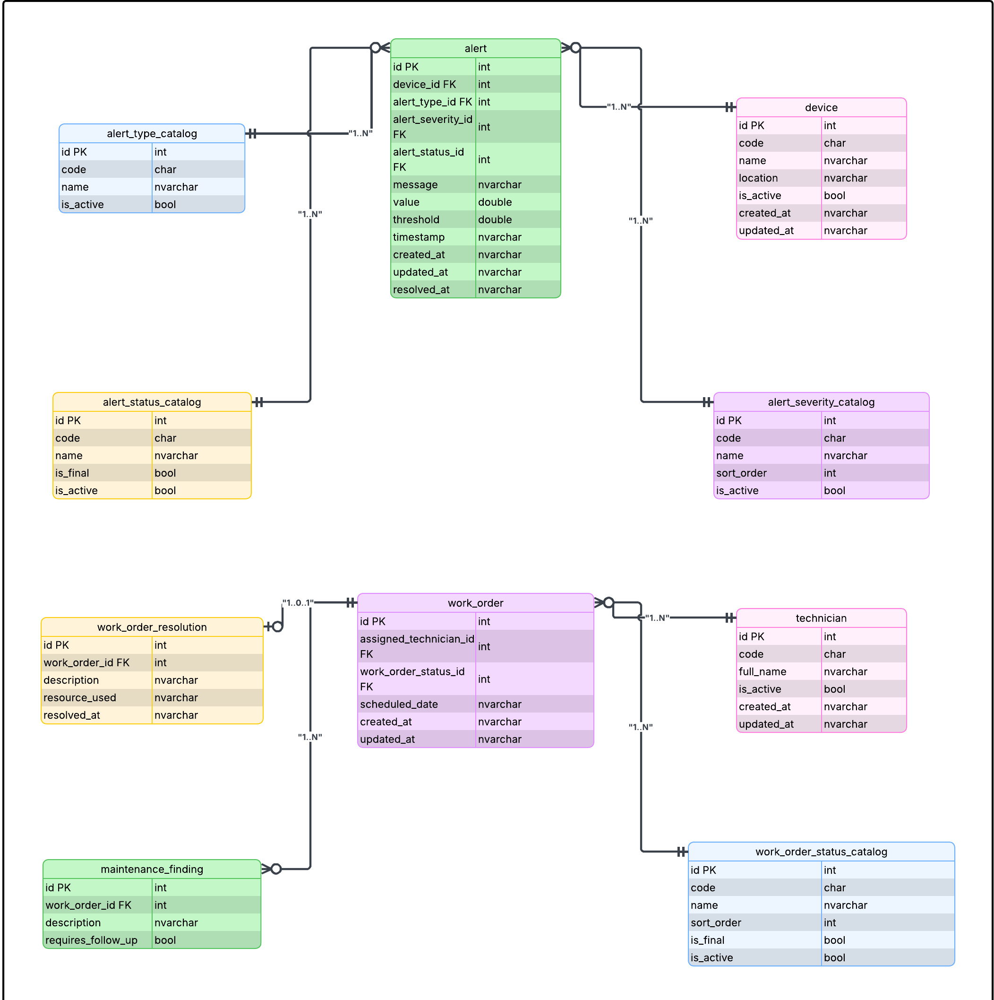
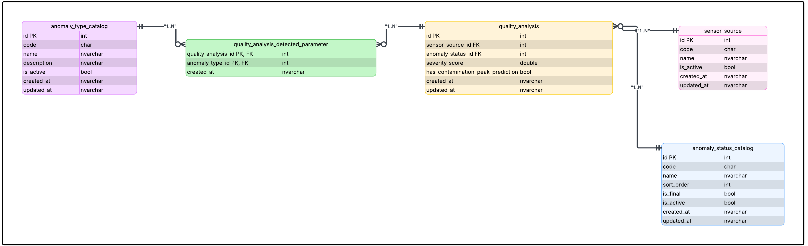
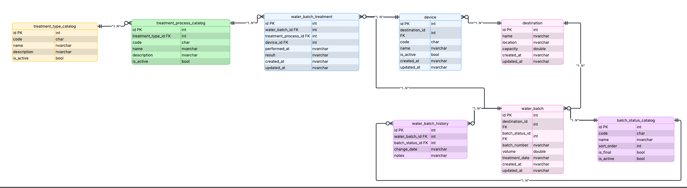

## 4.8. Database Design

El diseño de la base de datos resulta vital en la construcción de Aquanetix[cite: 1]. Establece la base estructural necesaria para resguardar grandes volúmenes de telemetría, así como registros logísticos de consumo hídrico con máxima seguridad[cite: 1]. Se aplica un método riguroso al definir las entidades, llaves foráneas, sumado a reglas de integridad relacional enfocadas en evitar redundancias[cite: 1]. Dicha organización estructurada mediante *Bounded Contexts* garantizará consultas veloces para los reportes ambientales exigidos por los auditores[cite: 1].

### 4.8.1. Database Diagrams

A continuación, se detalla el esquema relacional para cada *Bounded Context*[cite: 1]. Se especifican las tablas principales, sus columnas, las restricciones aplicadas, evidenciando también las relaciones entre los distintos objetos para la correcta persistencia de la información[cite: 1].

#### 1. Bounded Context: Subscription
Este diagrama define la persistencia de los planes comerciales, sumado a las suscripciones activas de los clientes.

**Explicación del esquema:**
*   **Tablas:** `subscription`, `plan_definition`, `user_account`, `plan_catalog`.
*   **Columnas principales:** `start_date`, `end_date`, `is_active` en la suscripción; `price`, `duration_in_months`, `max_devices` en la definición del plan.
*   **Constraints o Relaciones:** Cada tabla posee su identificador `id` configurado como llave primaria (`PK`). La entidad `subscription` utiliza llaves foráneas (`FK`) como `user_account_id` para relacionarse con la cuenta del usuario, junto con `plan_definition_id` para vincularse al plan adquirido. Esto establece relaciones de uno a muchos, asegurando la integridad referencial de los servicios contratados.

#### 2. Bounded Context: Devices
Este diagrama estructura el almacenamiento del inventario IoT, incluyendo sus configuraciones operativas.

**Explicación del esquema:**
*   **Tablas:** `device`, `threshold_configuration`, `device_owner`, `device_destination`, además de catálogos de estado o tipo.
*   **Columnas principales:** `serial_number`, `current_value`, `location` para los dispositivos; `min_value`, `max_value`, `unit` para los umbrales.
*   **Constraints o Relaciones:** Se definen llaves primarias (`PK`) en todas las entidades. La tabla `device` centraliza múltiples llaves foráneas (`FK`), referenciando al propietario (`owner_id`), al destino logístico (`destination_id`), así como a sus respectivos catálogos. Por otro lado, la tabla `threshold_configuration` se relaciona con el sensor mediante la FK `device_id`, permitiendo configurar múltiples límites de alerta para un mismo equipo físico.

#### 3. Bounded Context: Monitoring
Este diagrama detalla la persistencia del motor de alertas, conectando las incidencias con las labores de campo.

**Explicación del esquema:**
*   **Tablas:** `alert`, `work_order`, `technician`, `maintenance_finding`, `work_order_resolution`, apoyadas por diversos catálogos.
*   **Columnas principales:** `message`, `value`, `threshold` en alertas; `scheduled_date` en órdenes de trabajo; `description`, `requires_follow_up` en los hallazgos.
*   **Constraints o Relaciones:** La entidad `alert` emplea llaves foráneas para asociarse al dispositivo de origen (`device_id`), sumado a los catálogos de severidad. La tabla `work_order` se vincula al técnico asignado mediante `assigned_technician_id`. Asimismo, los reportes de mantenimiento (`maintenance_finding`) referencian a la orden de trabajo original usando `work_order_id`, garantizando la trazabilidad completa en las operaciones correctivas.

#### 4. Bounded Context: Dashboard
Este esquema modela la base relacional para la analítica avanzada de contaminación hídrica.

**Explicación del esquema:**
*   **Tablas:** `quality_analysis`, `sensor_source`, `quality_analysis_detected_parameter`, junto con catálogos de anomalías.
*   **Columnas principales:** `severity_score`, `has_contamination_peak_prediction` en los análisis de calidad.
*   **Constraints o Relaciones:** Se asegura la normalización resolviendo la relación de muchos a muchos mediante la tabla intermedia `quality_analysis_detected_parameter`. Esta entidad une el análisis central (`quality_analysis_id`) con los tipos de anomalía específicos (`anomaly_type_id`) usando llaves foráneas compuestas. Esto facilita las consultas complejas requeridas por los paneles gerenciales.

#### 5. Bounded Context: Service Design
Este diagrama traza el ciclo de vida logístico del agua recuperada hacia sus destinos finales.

**Explicación del esquema:**
*   **Tablas:** `water_batch`, `water_batch_history`, `water_batch_treatment`, `destination`, `device`, sumado a sus respectivos catálogos de procesos.
*   **Columnas principales:** `batch_number`, `volume`, `treatment_date` en los lotes; `capacity`, `location` en los destinos.
*   **Constraints o Relaciones:** La entidad principal `water_batch` contiene la llave foránea `destination_id` para referenciar el punto de entrega logístico. Para registrar auditorías ambientales, la tabla `water_batch_history` guarda todos los cambios de estado del lote. Además, la tabla `water_batch_treatment` documenta el proceso químico aplicado, conectando el volumen de agua con el dispositivo encargado del tratamiento mediante las FK correspondientes.