## 5.2. Landing Page, Services & Applications Implementation.
El desarrollo de la pagina principal, acoplamiento de servicios e implementación de las aplicaciones se consideran como pasos de alta importancia en lo que refiere a la elaboración del proyecto. Con el apoyo de estas etapas, permite al equipo tranformar conceptos simples en productos preparados para su uso. Esta fase nos ayuda a traducir los requisitos y especificaciones obtenidas a código con la finalidad de cumplir con las necesidades de nuestros segmentos objetivos.

### 5.2.1. Sprint 1
El primer sprint de nuestro proyecto posee una gran importancia en lo que refiere al proceso de desarrollo ágil. A lo largo de este periodo, se ha dado un enfoque con mayor énfasis en la implementación de las caracetericas fundamentales así como en las funcionalidades de mayor prioridad en nuestra planificación de inicio.

#### 5.2.1.1. Sprint Planning 1.

Para este sprint, la reunión de Sprint Planning nos permite evaluar nuestra velocidad previa y definir las nuevas metas técnicas del proyecto. En esta fase, el equipo selecciona las historias de usuario prioritarias del backlog, estima el esfuerzo necesario y asigna las tareas. El objetivo principal es mantener la alineación del equipo y garantizar que las nuevas funcionalidades operativas se integren de manera fluida, estableciendo un plan de trabajo claro.

| Campo / Sección | Detalle |
| :--- | :--- |
| Sprint # | Sprint 1 |
| Date | 2026-04-22 |
| Time | 9:00 PM |
| Location | Google meet |
| Prepared By | Castro Solorza, Nicolas Eduardo |
| Attendees (to planning meeting) | Pinedo Sánchez, Sebastián Martín / Castro Solorza, Nicolás Eduardo / Cochachi Chagua, Sebastián Josué / Correa Rodríguez, Andrea Khristina Esther / Bojórquez Bustinza, Renzo Alejandro |
| Sprint 1  Review Summary | Al ser el primer sprint del proyecto, no existe una revisión de un sprint anterior. El equipo partió de la aprobación del Product Backlog inicial, enfocándose en las Historias de Usuario prioritarias relacionadas al registro de empresas (Enterprise), configuración de planes y seguridad. |
| Sprint 1  Retrospective Summary | De igual manera al ser el inicio del proyecto, se establecieron las normas de trabajo del equipo: reuniones de seguimiento (Daily Stand-ups) mediante Meet, uso de herramientas ágiles para el control de tareas, sumado a la necesidad de mantener una comunicación constante para evitar bloqueos técnicos en el desarrollo del backend. |
| Sprint 1 Goal |Nuestro enfoque se centra en comunicar nuestra propuesta de valor de la plataforma a los visitantes de la Landing Page.<br>Creemos que esto entregará una Landing Page llamativa, con datos reales, que interesen a los visitantes.<br>Esto será confirmado cuando los visitantes examinen la Landing Page y demuestren interés en suscribirse dando clic al botón de Acceso al Dashboard, aunque este no sea funcional aún.|
| Sprint 1 Velocity | El equipo ha establecido un Velocity de 26 Story Points, que representa la capacidad máxima de esfuerzo que los developers pueden aceptar de manera realista para este Sprint 1. |
| Sum of Story Points | 24 |

#### 5.2.1.2 Aspect Leaders and Collaborators

En esta sección se presenta la matriz de liderazgo y colaboración (LACX), donde se definen los roles de cada integrante del equipo en los distintos aspectos considerados dentro del Sprint.

Los aspectos seleccionados corresponden a las principales áreas del proyecto Aquanetix, incluyendo diseño UX/UI, desarrollo de la landing page, documentación y modelado del sistema.

| Team Member (Last Name, First Name) | GitHub Username | UX/UI Design | Landing Page | Documentation | Modeling |
|------------------------------------|----------------|-------------|-------------|--------------|----------|
| Bojórquez Bustinza, Renzo Alejandro | DeterminedSoul7 | C | C | C | L |
| Correa Rodriguez, Andrea Khristina Esther | Daiko-07 | C | C | C | C |
| Castro Solorza, Nicolás Eduardo | NicoCSE | C | L | L | C |
| Cochachi Chagua, Sebastian Josue | sebastiancochachi02-cmd | L | C | C | C |
| Pinedo Sanchez, Sebastián Martín | smp1107 | L | C | C | C |

#### 5.2.1.3 Sprint Backlog 1

El objetivo del presente Sprint fue el diseño y desarrollo de la landing page del sistema Aquanetix, enfocándose en la comunicación efectiva de la propuesta de valor, la presentación de funcionalidades clave y la facilitación del contacto con potenciales usuarios.

<div align="center">
  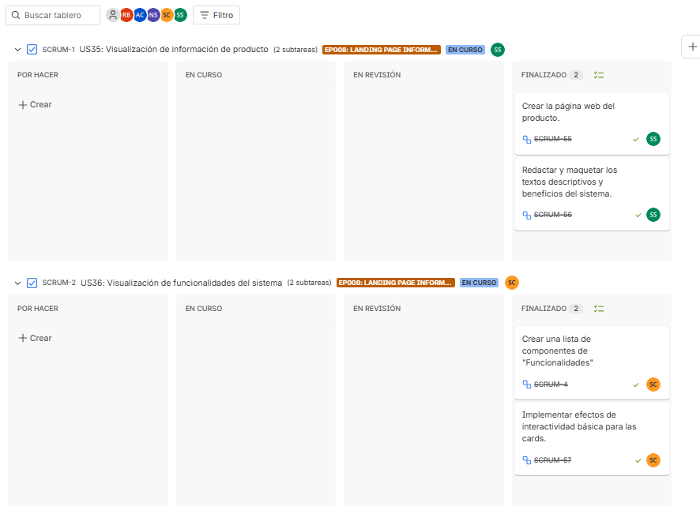
  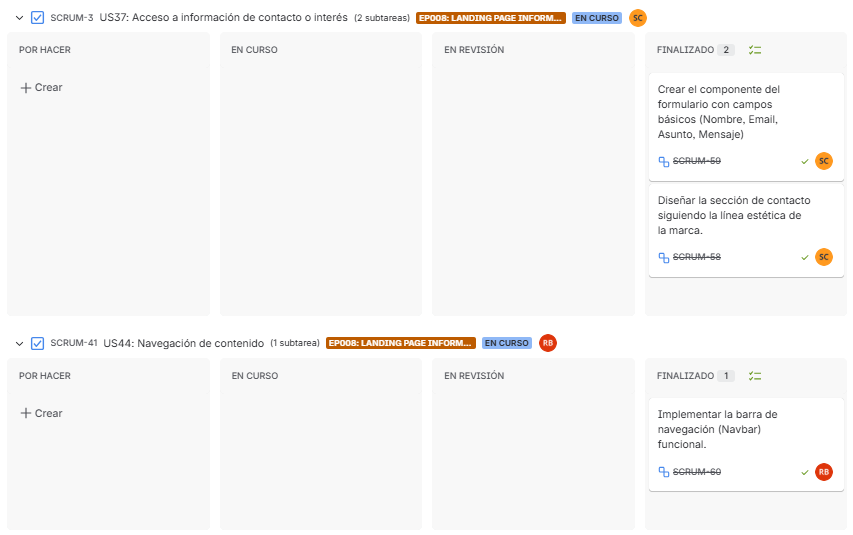
  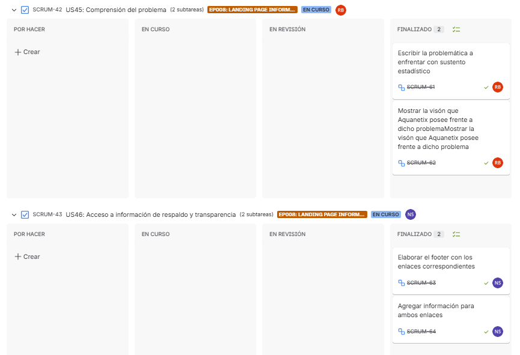
  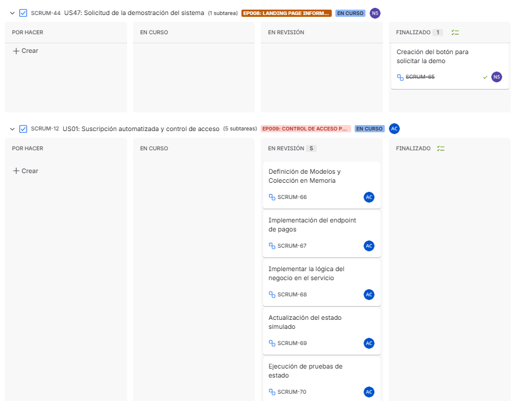
</div>

Durante este Sprint, el equipo trabajó de manera colaborativa en la construcción de las diferentes secciones de la landing page, asegurando una experiencia de usuario clara, intuitiva y alineada con los objetivos del sistema.

A continuación, se detallan las User Stories priorizadas y las tareas asociadas:

| US Id | Title | Task Id | Task Title | Description | Estimation (Hours) | Assigned To | Status |
|------|------|--------|------------|------------|-------------------|-------------|--------|
| US-35 | Product value visualization | T-01 | Landing page structure | Diseño e implementación de la estructura general y sección principal (hero) de la landing page | 6 | Sebastián Pinedo | Done |
| US-36 | System features visualization | T-02 | Features section development | Diseño y desarrollo de la sección de funcionalidades destacando las capacidades del sistema | 5 | Sebastián Cochachi | Done |
| US-37 | Contact information access | T-03 | Contact and CTA section | Implementación de sección de contacto y botones de llamada a la acción | 4 | Nicolás Castro | Done |
| US-35 | Product value visualization | T-04 | Content definition and UX writing | Definición del contenido textual y estructura comunicativa de la landing | 4 | Andrea Correa | Done |
| US-36 | System features visualization | T-05 | Visual design elements | Diseño de elementos visuales y apoyo gráfico para mejorar la experiencia de usuario | 4 | Renzo Bojórquez | In-Process |

#### 5.2.1.4 Development Evidence for Sprint Review

| Repository | Branch | Commit Ids | Commit Message | Commit Message Body | Committed on (Date) |
|------------|--------|-----------|----------------|---------------------|---------------------|
| aquanetix-repo | develop | 4f01889ae5953aba422050a86048518fc2e68577 | docs: add epics for requirements |  | 18/04/2026 |
| aquanetix-repo | develop | 80782311c16b14e26ad36489823096a0602afeb2 | docs: add landing page UI design |  | 20/04/2026 |
| aquanetix-repo | develop | 056333d1b065eda419cb3e109ebf525a4c3749cc | docs: add C4 model diagrams |  | 21/04/2026 |
| aquanetix-repo | develop | 73157436b4d739e7e78aa21fb0a791de3101dc81 | fix: update repository links |  | 21/04/2026 |
| aquanetix-repo | develop | 68a41d56032b2c50eb7a681cc9581219c6923cd7 | docs: add web app mockups |  | 22/04/2026 |

#### 5.2.1.5 Execution Evidence for Sprint Review

En esta sección se presentan evidencias de la ejecución de la landing page desarrollada durante el Sprint.

Las siguientes capturas muestran la interacción del usuario con las diferentes secciones de la landing page, permitiendo validar la estructura de información, la propuesta de valor y la navegación definida para el sistema Aquanetix.

**Figura 1. Sección principal de la landing page**

<div align="center">
  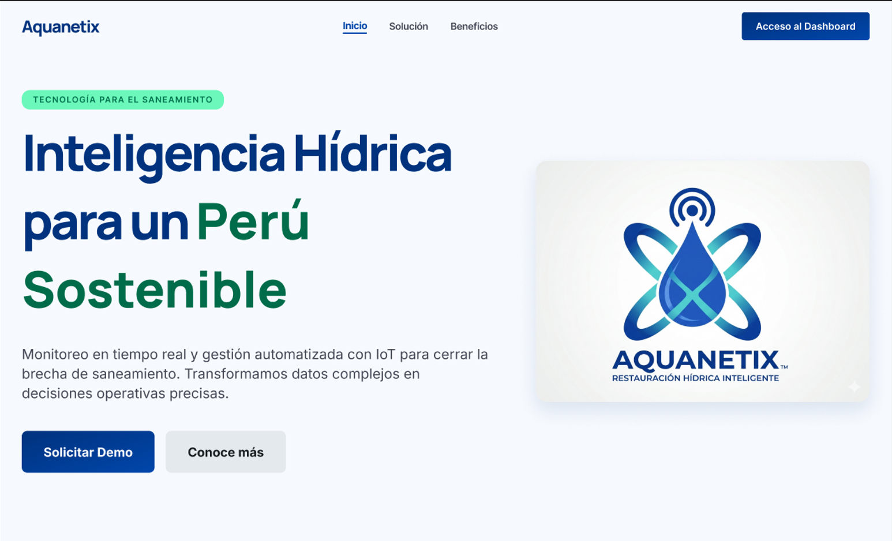
</div>
La figura muestra la sección principal de la landing page, donde se presenta la propuesta de valor del sistema Aquanetix junto con un llamado a la acción dirigido al usuario.


**Figura 2. Sección informativa de la landing page**

<div align="center">
  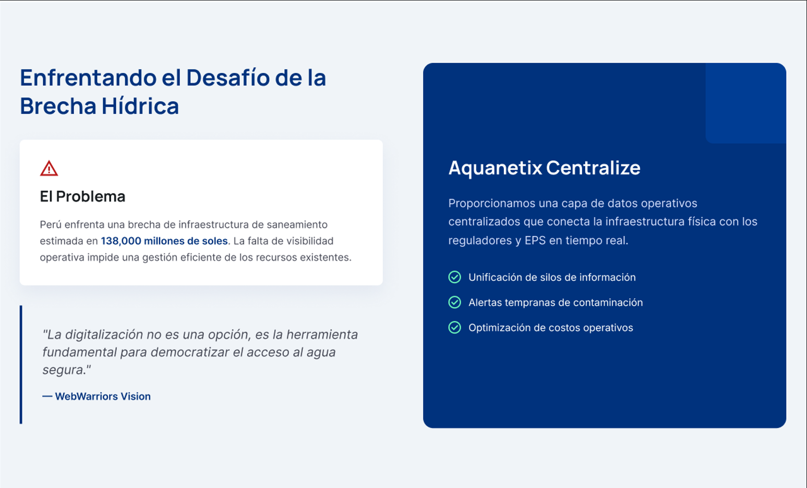
</div>

En esta sección se describe el problema abordado y la solución propuesta por el sistema, permitiendo al usuario comprender el propósito y beneficios del servicio.

**Figura 3. Sección de funcionalidades**

<div align="center">
  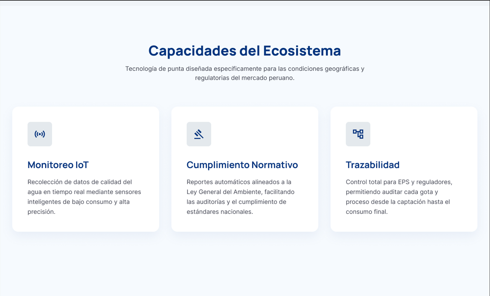
</div>

La figura muestra las principales funcionalidades del sistema, destacando las capacidades de monitoreo, gestión de alertas y análisis de datos.

**Figura 4. Sección final y llamado a la acción**

<div align="center">
  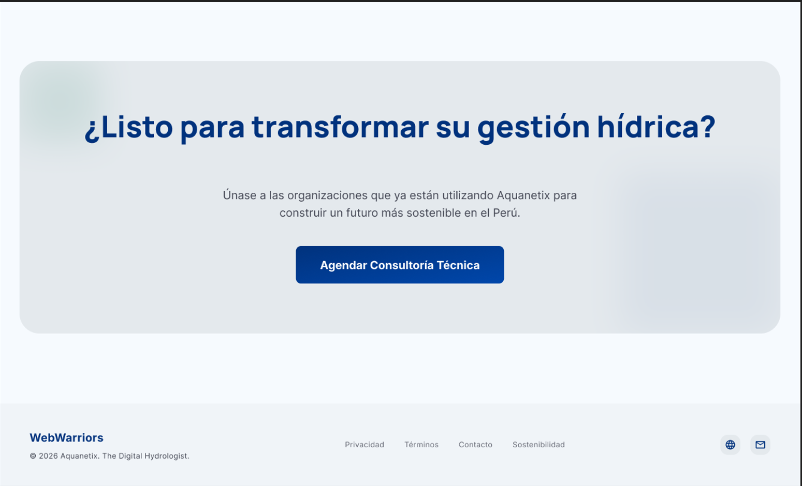
</div>

En esta sección final se incluye un llamado a la acción que invita al usuario a interactuar con el sistema, junto con información adicional relevante.

#### 5.2.1.6 Services Documentation Evidence for Sprint Review

En el alcance del presente Sprint, no se han implementado servicios web ni endpoints documentados con OpenAPI, debido a que el desarrollo del proyecto se ha centrado principalmente en la construcción de la landing page estática y en el diseño del prototipo de la aplicación.
Por lo tanto, en esta fase no se cuenta con documentación de Web Services, ya que estos serán considerados en Sprints posteriores, donde se abordará la implementación técnica del sistema y la integración de servicios backend.

#### 5.2.1.7. Software Deployment Evidence for Sprint Review.

Esta seccion se ha decidido omitir debido que, para este avance, solamente se ha enfocado en el diseño de Landing Page. En futuros entregables se procedera a brindar una informacion mas detallada de la aplicacion.

#### 5.2.1.8. Team Collaboration Insights during Sprint

Para el desarrollo de este primer sprint, todos los miembros del equipo desarrollaron y colaboraron de manera activa ycontinua. De tal modo, se muestra como evidencia los insights de cada miembro del equipo.
<p align = "left">
   
</p>

### 5.2.2. Sprint 2
El segundo sprint de nuestro proyecto estuvo enfocado en el desarrollo de funcionalidades relacionadas al monitoreo inteligente de la red hídrica, la gestión de alertas automáticas y la administración de parámetros operativos dentro del sistema. Durante este periodo, el equipo priorizó la implementación de módulos backend orientados al procesamiento de datos de sensores, validación de condiciones críticas y generación de información operativa para supervisores y operadores técnicos.

#### 5.2.2.1. Sprint Planning 2.

En esta sección se especifican los aspectos principales del Sprint Planning Meeting. El segundo sprint de nuestro proyecto posee una gran importancia en lo que refiere al proceso de desarrollo ágil y la construcción de la lógica de negocio en el backend. A lo largo de este periodo, se ha dado un enfoque con mayor énfasis en la implementación de las características fundamentales de monitoreo químico y la gestión de acceso, así como en las funcionalidades de mayor prioridad en nuestra planificación de inicio, asegurando que el equipo entregue valor tangible a los usuarios de la plataforma.

| Campo / Sección | Detalle |
| :--- | :--- |
| Sprint # | Sprint 2 |
| Date | 2026-05-10 |
| Time | 9:00 PM |
| Location | Google meet |
| Prepared By | Castro Solorza, Nicolas Eduardo |
| Attendees (to planning meeting) | Pinedo Sánchez, Sebastián Martín / Castro Solorza, Nicolás Eduardo / Cochachi Chagua, Sebastián Josué / Correa Rodríguez, Andrea Khristina Esther / Bojórquez Bustinza, Renzo Alejandro |
| Sprint 2  Review Summary | Durante el Sprint 2 se lograron desplegar los cimientos de la arquitectura frontend y los endpoints iniciales pertenecientes a los bounded context identificados. El Product Owner validó positivamente la estructura inicial, pero resaltó que para entregar verdadero valor al negocio es prioritario enfocarse ahora en el flujo de suscripciones que habilita los tableros, y en el motor de reglas de los sensores químicos para la detección temprana de anomalías. |
| Sprint 2  Retrospective Summary | El equipo identificó como un gran acierto la comunicación constante en los Daily Stand-ups. Sin embargo, como oportunidad de mejora, se evidenció la necesidad de aplicar de forma más estricta las buenas prácticas de programación (uso de DTOs, Inyección de Dependencias y manejo de excepciones) desde la planificación de las tareas, para evitar bloqueos técnicos y mantener un flujo de trabajo continuo. |
| Sprint 2 Goal |Nuestro enfoque está en captar la atención de los visitantes de la página web de Aquanetix y darles a las empresas la posibilidad de monitorear sus dispositivos con seguridad.<br>Creemos que esto proporcionará una Landing Page atractiva para los visitantes y una aplicación de monitoreo y registro de dispositivos consistente para las empresas.<br>Esto se confirmará cuando los visitantes puedan acceder a la plataforma directamente desde la Landing Page y las empresas puedan registrar sus dispositivos y alertas y que estos estén conectados a una MockAPI.|
| Sprint 2 Velocity | Para este Sprint 2, evaluando el desempeño previo y la capacidad actual del equipo, se ha establecido un Velocity de 67 Story Points. |
| Sum of Story Points | 67 |

#### 5.2.2.2 Aspect Leaders and Collaborators

En esta sección se presenta la matriz de liderazgo y colaboración (LACX), donde se definen los roles de cada integrante del equipo en los distintos aspectos considerados dentro del Sprint.

Los aspectos seleccionados corresponden a las principales áreas del proyecto Aquanetix, incluyendo diseño UX/UI, desarrollo de la web application, documentación y modelado del sistema.

| Team Member (Last Name, First Name) | GitHub Username | UX/UI Design | Web Application | Documentation | Modeling |
|------------------------------------|----------------|-------------|-------------|--------------|----------|
| Bojórquez Bustinza, Renzo Alejandro | DeterminedSoul7 | C | C | C | L |
| Correa Rodríguez, Andrea Khristina Esther | Daiko-07 | C | L | C | C |
| Castro Solorza, Nicolás Eduardo | NicoCSE | C | C | L | C |
| Cochachi Chagua, Sebastian Josue | sebastiancochachi02-cmd | L | C | C | C |
| Pinedo Sanchez, Sebastián Martín | smp1107 | L | C | C | C |


#### 5.2.2.3. Sprint Backlog 2

El objetivo de este sprint backlog 2 fue el designar tareas referente al frontend de nuestra web application del sistema Aquanetix en lo que refiere a diseño y funcionalidad. Mayormente el enfoque fue la maquetación de los paneles de control y la integración de la interfaz con las lógicas de estado, garantizando que el sistema refleje adecuadamente los datos de calidad de agua y las métricas operativas del usuario.

Durante este Sprint, el equipo trabajó de manera colaborativa en la construcción de las diferentes secciones de la web application, asegurando una muestra del como funciona la aplicacion que se está proponiendo.

<div align="center">
  
  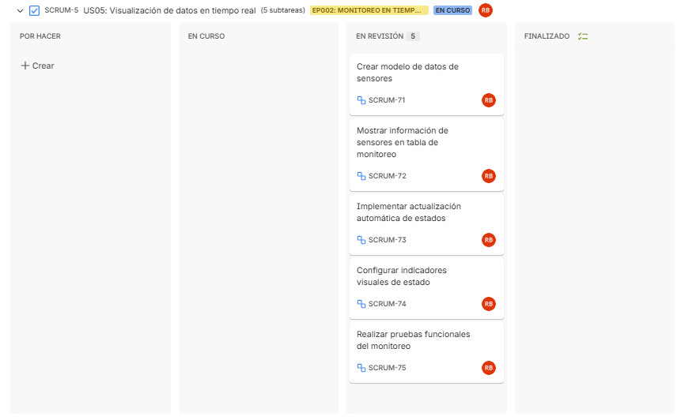
  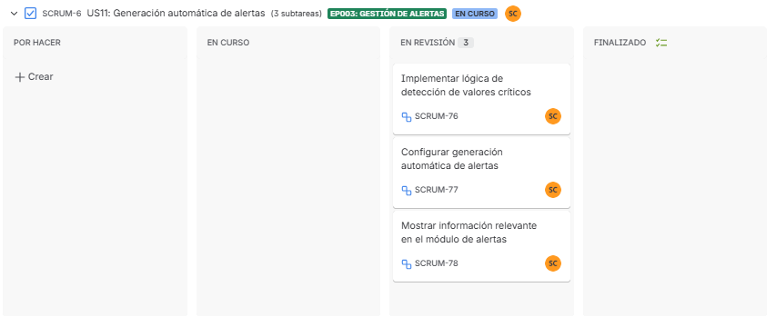
  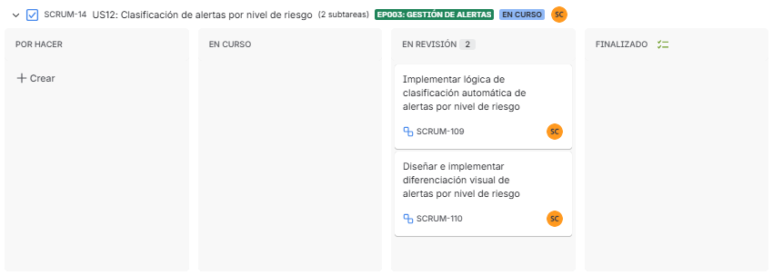
</div>

Enlace a la herramienta utilizada: https://shorturl.at/xs1Pv

A continuación, se detallan las User Stories priorizadas y las tareas asociadas:

| US Id | Title | Task Id | Task Title | Description | Estimation (Hours) | Assigned To | Status |
|------|------|--------|------------|------------|-------------------|-------------|--------|
| US-38 | Detectar alertas críticas en tiempo real | T-01 | Implementar lógica de detección de alertas | Implementar lógica de detección de alertas | 6 | Sebastián Pinedo | Done |
| US-5 | Actualizar automáticamente el estado de los sensores | T-02 | Implementar actualización automática de estados | Implementar actualización automática de estados | 5 | Sebastián Cochachi | Done |
| US-11 | Generar alertas automáticas por valores fuera de rango | T-03 | Configurar generación automática de alertas | Configurar generación automática de alertas | 4 | Nicolás Castro | Done |
| US-12 | Clasificar alertas según nivel de riesgo | T-04 | Implementar lógica de clasificación automática de alertas por nivel de riesgo | Implementar lógica de clasificación automática de alertas por nivel de riesgo | 4 | Andrea Correa | Done |

#### 5.2.2.4. Development Evidence for Sprint Review

| Repository | Branch | Commit Ids | Commit Message | Commit Message Body | Committed on (Date) |
|------------|--------|-----------|----------------|---------------------|---------------------|
| WebApplication_Aquanetix | develop | 3028d6d79409993a81a02a99d84606e038ac2841 | feat: add sensor detail component |  | 14/05/2026 |
| WebApplication_Aquanetix | develop | 2f9f599387448876028acb45cdcf1fbed068cefa | feat: app components updated |  | 14/05/2026 |
| WebApplication_Aquanetix | develop | 322d5421d02267d5d4a4af56c0c68c24422f61cd | feat: sensor-list.component.ts code completed |  | 14/05/2026 |
| WebApplication_Aquanetix | develop | aa2eb3de23c60a8d5ba16754eea2a6c472f89c55 | feat: Add application directory |  | 14/05/2026 |
| WebApplication_Aquanetix | develop | a2d8ad7b3ae19f3735297f1487767733b59ea87a | feat: resources imported |  | 14/05/2026 |


#### 5.2.2.5. Execution Evidence for Sprint Review

En esta sección se presentan evidencias de la ejecución de la web application desarrollada durante el Sprint.

Las siguientes capturas muestran la interacción del usuario con las diferentes secciones de la web application.

**Figura 1. Dashboard principal**

<div align="center">
  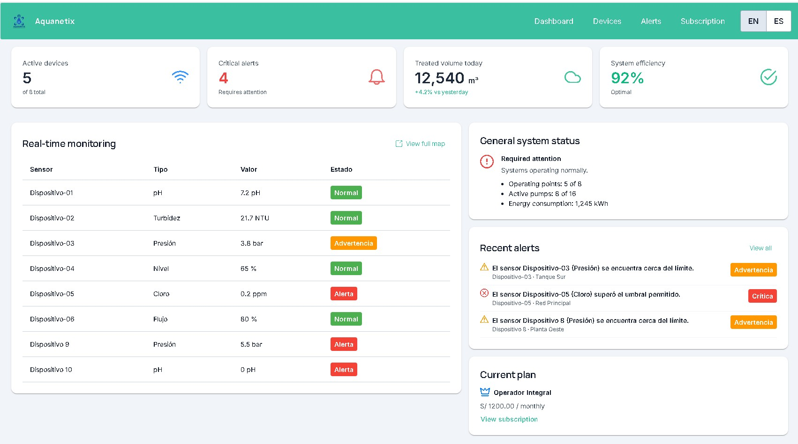
</div>

La figura muestra el dashboard principal de la web application Aquanetix, donde el usuario puede visualizar en tiempo real el estado general del sistema, incluyendo dispositivos activos, alertas críticas, volumen tratado y eficiencia operativa. Además, se presentan tablas y paneles informativos que facilitan el monitoreo y supervisión de los sensores conectados.

**Figura 2. Listado de dispositivos**

<div align="center">
  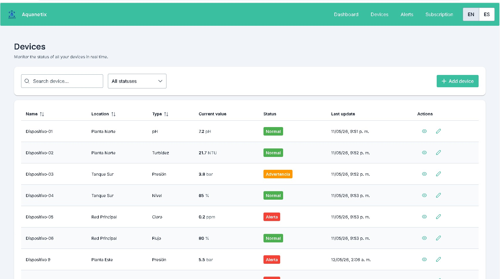
</div>

La figura muestra la sección de dispositivos de la aplicación web, donde se presenta una tabla con todos los sensores registrados en el sistema. El usuario puede visualizar información relevante como ubicación, tipo de sensor, valor actual y estado operativo, además de realizar acciones de consulta y edición sobre cada dispositivo.

**Figura 3. Registro de nuevo dispositivo**

<div align="center">
  
</div>

La figura representa el formulario de registro de nuevos dispositivos dentro de la plataforma Aquanetix. El usuario puede ingresar información relacionada al sensor, como nombre, ubicación, tipo, unidad de medida y umbrales permitidos, facilitando la incorporación de nuevos dispositivos al sistema de monitoreo.

**Figura 4. Gestión de alertas**

<div align="center">
  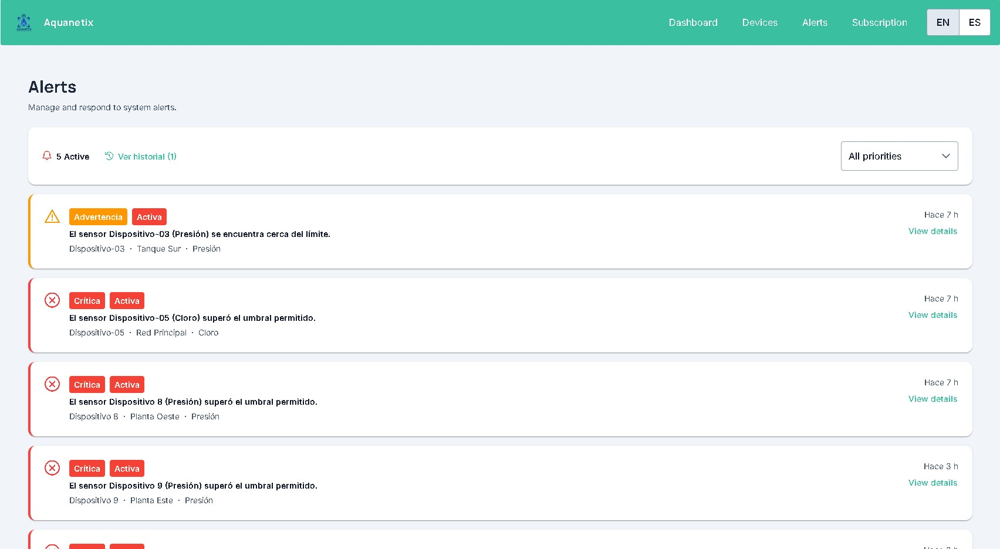
</div>

La figura muestra el módulo de alertas de la aplicación web, en el cual el usuario puede visualizar y gestionar alertas activas generadas por los sensores del sistema. Cada alerta incluye información relacionada al dispositivo, nivel de prioridad y ubicación, permitiendo identificar rápidamente incidencias críticas dentro de la operación.

**Figura 5. Gestión de suscripción**

<div align="center">
  
</div>


#### 5.2.2.6. Services Documentation Evidence for Sprint Review

En el alcance del presente Sprint 2, el equipo no ha implementado un Web Service propio con documentación OpenAPI/Swagger, dado que el backend formal en ASP.NET Core corresponde a un entregable posterior (AV2/TB2). Sin embargo, la Frontend Web Application integra dos servicios REST externos que actúan como fuente de datos simulada durante esta fase de desarrollo:

**Servicio 1 — MockAPI (Sensores y Alertas)**
URL base: `https://6a01f74d0d92f63dd2531d8e.mockapi.io/api/v1`

| Endpoint | Verbo HTTP | Descripción | Parámetros | Response ejemplo |
|----------|-----------|-------------|------------|-----------------|
| `/sensors` | GET | Obtiene todos los dispositivos IoT registrados | — | Array de objetos Sensor (id, name, location, type, currentValue, unit, status, minAlert, maxAlert, history) |
| `/sensors/{id}` | GET | Obtiene un dispositivo por ID | `id`: string | Objeto Sensor |
| `/sensors` | POST | Registra un nuevo dispositivo IoT | Body: objeto Sensor sin id | Objeto Sensor creado con id asignado |
| `/sensors/{id}` | PUT | Actualiza datos de un dispositivo | `id`: string · Body: objeto Sensor | Objeto Sensor actualizado |
| `/sensors/{id}` | DELETE | Elimina un dispositivo | `id`: string | Objeto eliminado |
| `/alerts` | GET | Obtiene todas las alertas del sistema | — | Array de objetos Alert (id, sensorName, location, type, severity, message, timestamp, status, value, threshold) |
| `/alerts` | POST | Crea una nueva alerta automática | Body: objeto Alert sin id | Objeto Alert creado |
| `/alerts/{id}` | PUT | Actualiza el estado de una alerta (ej. Resuelta) | `id`: string · Body: objeto Alert | Objeto Alert actualizado |
| `/alerts/{id}` | DELETE | Elimina una alerta | `id`: string | Objeto eliminado |

**Servicio 2 — MockAPI (Suscripción y Planes)**
URL base: `https://69fb530188a7af0ecca8fada.mockapi.io/api/v1`

| Endpoint | Verbo HTTP | Descripción | Parámetros | Response ejemplo |
|----------|-----------|-------------|------------|-----------------|
| `/subscription` | GET | Obtiene la suscripción activa de la empresa | — | Objeto con plan, tier, price, currency, billingCycle, features, usage |
| `/subscription/{id}` | PUT | Actualiza el plan de suscripción | `id`: string · Body: objeto Subscription | Objeto Subscription actualizado |
| `/plans` | GET | Obtiene los planes disponibles | — | Array de objetos Plan (id, name, tier, monthlyPrice, annualMonthlyPrice, maxSensors, highlight, features) |

La interacción con estos servicios se realiza a través de la infraestructura definida en las clases `production`, `apiUrl`, `sensorsEndpoint`y `alertsEndpoint`, `subscriptionApiUrl`, `subscriptionEndpoint` y `plansEndpointi`, siguiendo la arquitectura DDD implementada en la aplicación. Las rutas de cada endpoint están configuradas en el archivo `.env` del proyecto.

La figura presenta la sección de suscripción de la plataforma, donde el usuario puede consultar la información de su plan actual, visualizar el uso de recursos disponibles y acceder a datos de facturación. Asimismo, se incluyen opciones para cambiar o cancelar la suscripción según las necesidades del usuario.

#### 5.2.2.7. Software Deployment Evidence for Sprint Review

Durante el Sprint 2, el equipo realizó el despliegue de la primera versión funcional de la **Frontend Web Application** de Aquanetix utilizando Firebase Hosting, plataforma de hosting en la nube de Google. A continuación se describen las actividades realizadas durante el proceso de despliegue.

---

### 1. Configuración del proyecto en Firebase

Se creó el proyecto `ss-aquanetix-webapplication` en Firebase Console, habilitando el servicio Firebase Hosting para publicar la aplicación Angular desarrollada con Angular CLI. Posteriormente, se vinculó el proyecto local ejecutando los siguientes comandos:

```bash
firebase login
firebase init hosting
```

Durante la configuración inicial se seleccionó la carpeta `dist/` generada por Angular como directorio público de despliegue y se habilitó el modo Single Page Application (SPA), permitiendo que todas las rutas sean redirigidas automáticamente hacia `index.html`.

---

### 2. Configuración del archivo firebase.json

Se configuró el archivo `firebase.json` para permitir el correcto funcionamiento del Angular Router mediante reglas de reescritura (rewrites), además de establecer configuraciones básicas de caché para los recursos estáticos.

```json
{
  "hosting": {
    "public": "dist",
    "ignore": ["firebase.json", "**/.*", "**/node_modules/**"],
    "rewrites": [
      {
        "source": "**",
        "destination": "/index.html"
      }
    ]
  }
}
```

---

### 3. Build y despliegue de la aplicación

Se generó el build de producción utilizando Angular CLI y posteriormente se desplegó la aplicación en Firebase Hosting mediante los siguientes comandos:

```bash
ng build
firebase deploy
```

---

### 4. URL de la aplicación desplegada

La aplicación fue publicada exitosamente y quedó accesible mediante la siguiente URL:

🔗 **https://ss-aquanetix-webapplication.web.app/monitoring/dashboard**

Al acceder al sistema, el usuario puede visualizar el Dashboard principal de monitoreo, incluyendo la información obtenida desde las APIs externas configuradas para la aplicación.

---

### 5. Configuración de variables de entorno

La aplicación utiliza archivos `environment.ts` para gestionar las variables de entorno y las rutas de conexión hacia los servicios externos utilizados durante el Sprint 2.

Entre las configuraciones principales se incluyen:

- URL base de las APIs externas.
- Endpoints de monitoreo y sensores.
- Configuración de alertas y suscripciones.
- Parámetros de entorno para producción y desarrollo.

Esta estructura permitió separar la configuración del entorno de desarrollo y producción, facilitando el despliegue y mantenimiento de la aplicación.

#### 5.2.2.8. Team Collaboration Insights during Sprint

Para el desarrollo de este segundo sprint, todos los miembros del equipo desarrollaron y colaboraron de manera activa y continua. De tal modo, se muestra como evidencia los insights de cada miembro del equipo.
<p align = "left">
   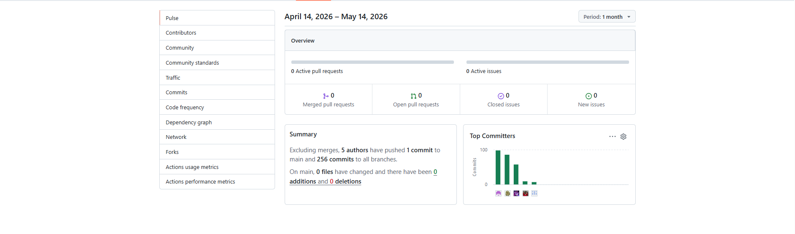
</p>
