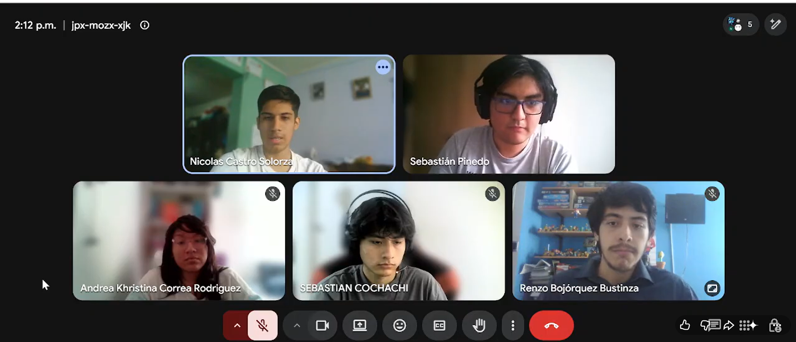

# Conclusiones

## Conclusiones y Recomendaciones
- Al comienzo del avance, el equipo ha mejorado en la propuesta y recaudacion de informacion para brindar una solucion frente a una problematica de contexto real en el pais.
- La implementacion de la Landing Page ha sido una pieza fundamental para el equipo ya que demuestra la capacidad de traducir los requisitos y especificaciones identificadas a un código totalmente funcional, desarrollando una estructura sólida y una vista de diseño atractivo y cómodo para la vista.
- El diseño de la Landing Page enfocado en la experiencia de usuario (UX/UI) y la optimización SEO garantizan que el mensaje de sostenibilidad y monitoreo IoT sea claro, logrando una tasa de conversión inicial óptima para el proyecto.
- La aplicación frontend consolidó una interfaz intuitiva y altamente responsiva, permitiendo a los usuarios visualizar gráficos dinámicos de los flujos de agua y gestionar alertas de manera eficiente sin fricciones técnicas.
- La arquitectura basada en componentes facilitó la integración limpia de servicios de consumo de datos y la internacionalización del sistema, asegurando que la plataforma esté lista para expandirse a nuevos mercados o añadir futuros módulos de control.
- El desarrollo de la aplicación Backend centralizó con éxito la lógica de negocio y el procesamiento de datos provenientes del monitoreo. La correcta configuración de la persistencia de datos y la seguridad en la capa de base de datos garantizan la integridad de la información sensible del sistema.
- El ecosistema completo de Aquanetix demuestra que la sinergia entre una estrategia de atracción (Landing Page), una interfaz de usuario clara (Frontend) y una infraestructura sólida (Backend/Cloud) es capaz de transformar un problema ambiental crítico en una solución tecnológica viable, automatizada y escalable para la gestión del agua.

## Recomendaciones
- Continuar ampliando las funcionalidades de la plataforma incorporando nuevos módulos que permitan fortalecer el monitoreo, análisis y gestión de los recursos hídricos.
- Implementar mecanismos de monitoreo y pruebas continuas que permitan garantizar la disponibilidad, seguridad y rendimiento del sistema en escenarios con un mayor número de usuarios y dispositivos.
- Integrar nuevas fuentes de información y sensores IoT para incrementar la precisión del monitoreo y mejorar la capacidad de respuesta ante posibles incidentes relacionados con la calidad o distribución del agua.
- Realizar evaluaciones periódicas de la experiencia de usuario (UX) con usuarios reales para identificar oportunidades de mejora y optimizar la usabilidad de la plataforma.
- Continuar fortaleciendo la arquitectura del sistema mediante buenas prácticas de desarrollo, documentación y mantenimiento, facilitando futuras actualizaciones y la incorporación de nuevos integrantes al proyecto.

## Video About-the-Team

### Resumen del video
En esta sección, se presenta un video que documenta de manera audiovisual el proceso del trabajo realizado a lo largo del proyecto, detallando cada actividad planificada y ejecutada. Asimismo se presenta los testimonios de cada uno de los integrantes del equipo en donde mencionan su aporte y colaboración en el proyecto.

### Enlaces de Publicación
| Elemento                  | Detalle                                                                |
|---------------------------|------------------------------------------------------------------------|
| Título del video          | `upc-pre-202610-1asi0730-12010-sourcesoldiers-about-the-team-sprint-4` |
| Plataforma de publicación | Microsoft Stream / SharePoint y YouTube                                |
| URL Microsoft Stream      | https://shorturl.at/rv6H5                                              |
| URL Youtube               | https://youtu.be/ysqWe6i2kMk                                           |
| Duración                  | 06:51 min                                                              |
| Fecha de publicación | 04/07/2026                                                             |

### Evidencia fotográfica del video
La siguiente captura corresponde al Video About-the-Team publicado para el cierre TF:

   

### Pauta de Secuencias de Contenido (Timing)
A continuación, se detalla la estructura del video indicando el momento exacto de inicio de cada bloque, el cual incluye el desarrollo del proyecto y los testimonios ante cámara de cada integrante:

| Timing (hh:mm:ss)   | Secuencia de contenido                                                                                                                                           | Detalles                                                                                                                                                         |
|---------------------|------------------------------------------------------------------------------------------------------------------------------------------------------------------|------------------------------------------------------------------------------------------------------------------------------------------------------------------|
| 00:00:00 - 00:01:52 | Escenas con imágenes y/o videos de sesiones de trabajo real del equipo. Acompañado de narración (voz en off) describiendo el proceso de desarrollo de Aquanetix. | Escenas con imágenes y/o videos de sesiones de trabajo real del equipo. Acompañado de narración (voz en off) describiendo el proceso de desarrollo de Aquanetix. |
| 00:01:53 - 00:02:39 | Testimonio de Renzo Alejandro Bojórquez Bustinza                                                                                                                 | Descripción detallada de las fortalezas y aportes que realizó Renzo Bojórquez en el proyecto.                                                                    |
| 00:02:40 - 00:03:38 | Testimonio de Nicolás Eduardo Castro Solorza                                                                                                                     | Descripción detallada de las fortalezas y aportes que realizó Nicolas Castro  en el proyecto.                                                                                  |
| 00:03:40 - 00:04:44 | Testimonio de  Sebastian Josue Cochachi Chagua                                                                            | Descripción detallada de las fortalezas y aportes que realizó Sebastián Cochachi en el proyecto.                                                                      |
| 00:04:50 - 00:05:42 | Testimonio de  Andrea Kristina Esther Correa Rodriguez                                                                                                                                                  | Descripción detallada de las fortalezas y aportes que realizó Andrea Correa en el proyecto.                                                                 |
| 00:05:43 - 00:06:51 | Testimonio de Sebastián Martin Pinedo Sánchez                                                                                                                    | Descripción detallada de las fortalezas y aportes que realizó Sebastián Pinedo en el proyecto.                                                                   |